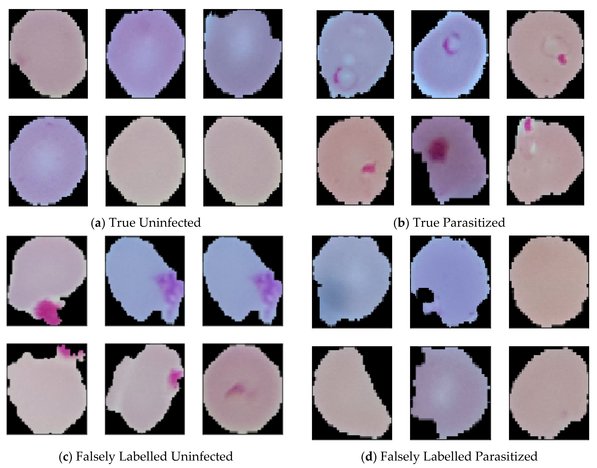
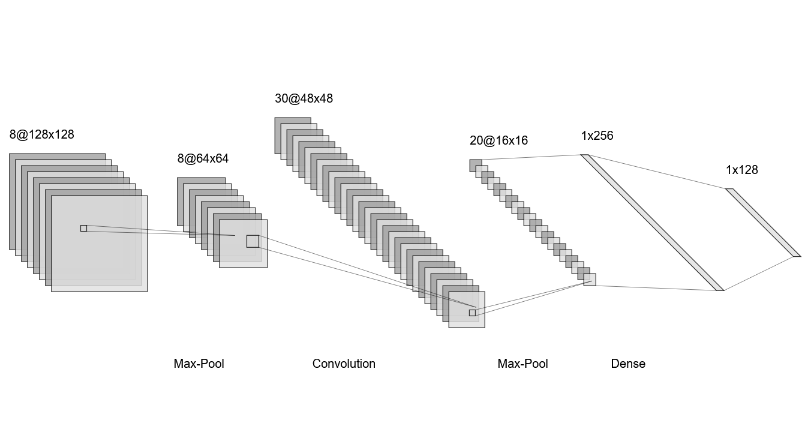
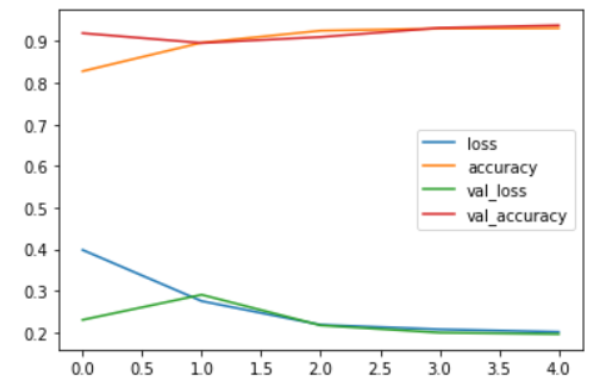
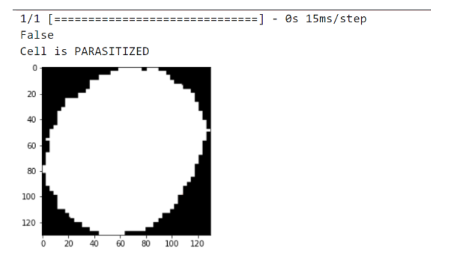

# Deep Neural Network for Malaria Infected Cell Recognition...

## Aim:

To develop a deep neural network for Malaria infected cell recognition and to analyze the performance.

## Problem Statement:

 We have a great dataset of labeled and preprocessed images to train and evaluate our model. NIH has a malaria dataset of 27,558 cell images with an equal number of parasitized and uninfected cells. A level-set based algorithm was applied to detect and segment the red blood cells. The images were collected and annotated by medical professionals; more information can be found here. 

## Dataset:

 

## Neural Network Model:



## Design Steps:

### STEP 1:
Import tensorflow and other required preprocessing libraries.

### STEP 2:
Download and load the malaria cell images dataset folder.

### STEP 3:
Split the dataset into training and testing folders.

### STEP 4:
Perform image data generation methods.

### STEP 5:
Build the (CNN model) convolutional neural network model for the dataset.

### STEP 6:
Train the model with the training data.

### STEP 7:
Plot the performance plot.

### STEP 8:
Evaluate the model by using the testing data using probability prediction(uninfected-> probability>0.5,parasitized-> <=0.5).

### STEP 9:
Fit the model and predict it with the sample input.

### STEP 10:
End the program.

## Program:

```python

### Developed by: Anto Richard. S
### Reg.no: 212221240005

Program to develop a deep neural network for Malaria infected cell recognition and to analyze the performance.

import os
import pandas as pd
import numpy as np
import seaborn as sns
import matplotlib.pyplot as plt
from matplotlib.image import imread
from tensorflow.keras.preprocessing.image import ImageDataGenerator
from tensorflow import keras
from tensorflow.keras import layers
from tensorflow.keras import utils
from tensorflow.keras import models
from sklearn.metrics import classification_report,confusion_matrix
import tensorflow as tf

from tensorflow.compat.v1.keras.backend import set_session
config = tf.compat.v1.ConfigProto()
config.gpu_options.allow_growth = True
config.log_device_placement = True
sess = tf.compat.v1.Session(config=config)
set_session(sess)
%matplotlib inline

my_data_dir = '/home/ailab/hdd/dataset/cell_images'
os.listdir(my_data_dir)
test_path = my_data_dir+'/test/'
train_path = my_data_dir+'/train/'
os.listdir(train_path)
len(os.listdir(train_path+'/uninfected/'))
len(os.listdir(train_path+'/parasitized/'))
os.listdir(train_path+'/parasitized')[0]
para_img= imread(train_path+
                 '/parasitized/'+
                 os.listdir(train_path+'/parasitized')[0])
para_img.shape 
plt.imshow(para_img)

dim1 = []
dim2 = []
for image_filename in os.listdir(test_path+'/uninfected'):
    img = imread(test_path+'/uninfected'+'/'+image_filename)
    d1,d2,colors = img.shape
    dim1.append(d1)
    dim2.append(d2)
sns.jointplot(x=dim1,y=dim2)
image_shape = (130,130,3)
image_gen = ImageDataGenerator(rotation_range=20,
                               width_shift_range=0.10
                               height_shift_range=0.10,
                               rescale=1/255, 
                               shear_range=0.1,
                               zoom_range=0.1,
                               horizontal_flip=True,
                               fill_mode='nearest'
                              )
image_gen.flow_from_directory(train_path)
image_gen.flow_from_directory(test_path)

model = models.Sequential()
model.add(layers.Input(shape=(128,128,3))) 
model.add(layers.Conv2D(filters=32,kernel_size=(3,3),padding="same",activation='relu'))
model.add(layers.AvgPool2D(pool_size=(2,2)))
model.add(layers.Conv2D(filters=32,kernel_size=(3,3),padding="same",activation='relu'))
model.add(layers.MaxPool2D(pool_size=(2,2)))
model.add(layers.Flatten())
model.add(layers.Dense(20,activation='relu')) 
model.add(layers.Dense(1, activation ='sigmoid'))
model.summary()

model.compile(optimizer='Adam',
              loss='binary_crossentropy',
              metrics=['accuracy'])
model.summary()

train_image_gen = image_gen.flow_from_directory(train_path,
                                               target_size=image_shape[:2],
                                                color_mode='rgb',
                                               batch_size=16,
                                               class_mode='binary')

train_image_gen.batch_size
len(train_image_gen.classes)
train_image_gen.total_batches_seen
test_image_gen = image_gen.flow_from_directory(test_path,
                                               target_size=image_shape[:2],
                                               color_mode='rgb',
                                               batch_size=batch_size,
                                               class_mode='binary', shuffle = False)
train_image_gen.class_indices       

results = model.fit(train_image_gen,epochs=5,validation_data=test_image_gen)

model.save('cell_model.h5')
losses = pd.DataFrame(model.history.history)
losses.plot()

model.evaluate(test_image_gen)
pred_probabilities = model.predict(test_image_gen)
test_image_gen.classe
predictions = pred_probabilities > 0.5
print(classification_report(test_image_gen.classes,predictions))

confusion_matrix(test_image_gen.classes,predictions)

from tensorflow.keras.preprocessing import image
img = image.load_img('mui.png')
img=tf.convert_to_tensor(np.asarray(img))
img=tf.image.resize(img,(130,130))
img=img.numpy()
type(img)
plt.imshow(img)

x_single_prediction = bool(model.predict(img.reshape(1,130,130,3))>0.6)
print(x_single_prediction)
if(x_single_prediction==1):
    print("Cell is UNINFECTED")
else:
    print("Cell is PARASITIZED")

```

## Output:

### Training Loss, Validation Loss Vs Iteration Plot:



### Classification Report:


### Confusion Matrix:


### New Sample Data Prediction:



## Result:

Thus, a deep neural network for Malaria infected cell recognition and to analyze the performance is successfuly done and verified using a Convolution Neural Network.
